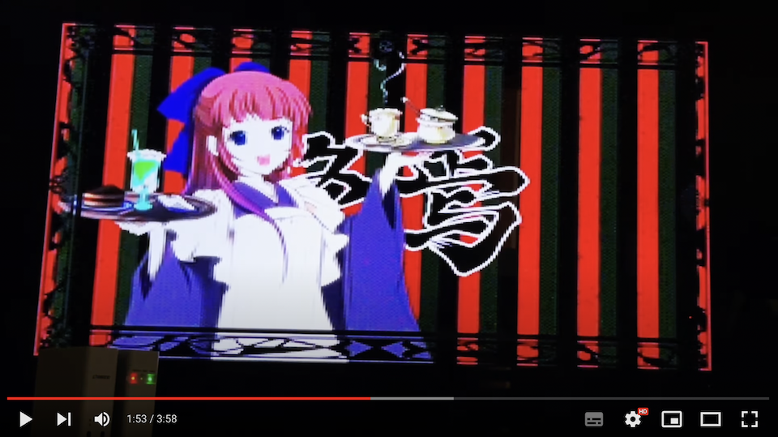

# RAWMVP.X

Raw Movie File Player for X68000Z/X680x0

---

## About This

ディスク上の無圧縮動画データを逐次読み取りしながら指定した画面モード・fps・音声で再生します。

 - ディスクから逐次読み取りを行うため再生開始までの待ち時間が短い
 - ディスクから直接GVRAMに転送を行うため高フレームレートが期待できる
 - 256x256x65536色, 384x256x65536色, 512x256x65536色の3種類の画面モードに対応
 - ADPCMによる音声の同期再生対応(要PCM8A.X)
 - ADPCMクロックアップに対応(要オシレータ交換 + PCM8A.X)
 - 16bitステレオPCMの内部同期再生対応(要Mercury-UNIT + PCM8PP.X)
 - 16bitステレオPCMの外部同期再生対応(要Raspberry Pi + s44raspd)

推奨環境：X68000Z 1.3.1以降 + USBメモリの擬似SCSI または エミュレータ + ホストファイルシステム

実際の再生例(X68000Z EAK 1.3.1)

---

## RAWMVPのインストール

RAWMPxxx.ZIP をダウンロードして、RAWMVP.X をパスの通ったディレクトリにコピーします。

---

## PCM8Aのインストール

ADPCM音声付きでの再生には PCM8A.X (原作:philly氏) が必要になります。

TcbnErik氏によるパッチ版の使用を推奨します。

* [https://github.com/kg68k/pcm8a](https://github.com/kg68k/pcm8a)

X68000Zで常駐の際の推奨コマンドライン:

    pcm8a -v0 -s1 off

無音モードで使う場合は不要です。

拡張子.p21/.p31のADPCMクロックアップ(20.8kHz/31.2kHz)データを使う場合は4MHzオシレータを16MHzオシレータに交換した上で、

    pcm8a -m1

としてクロックアップ対応モードで常駐させる必要があります。

---

## CRTMOD16のインストール

横384の正方形ドットモードを使う場合は、CRTMOD16.X (M.Kamada氏) が必要になります。

CRTMOD16.X は XEiJ のインストールパッケージの中の misc ディレクトリに含まれています。

* [https://stdkmd.net/xeij/miscfiles.htm](https://stdkmd.net/xeij/miscfiles.htm)    

常駐の際の推奨コマンドライン:

    crtmod16 -e

横384モードを使わない場合は不要です。

---

## データ再生に必要なメモリ

動画データは逐次読み込みのため、メインメモリをさほど消費しませんが、ADPCM音声データはメインメモリに丸ごと読み込むため、その分のメインメモリは必要です。

また、16bitPCMデータをPCM8PP.Xを使って再生する場合は16bitPCMデータをすべてハイメモリに読み込むため、060turbo互換のハイメモリとハイメモリドライバが必要です。

動作確認済みハイメモリドライバ：
* 68060 ... 060turbo.sys
* 68030/68040 ... TS16DRVp.X

---

## XEiJ + HFS での注意点

XEiJはこれを書いている時点での最新リリースバージョン(0.23.08.08)までの場合、ADPCM再生中にHFSからGVRAMにデータ読み込みを行うとADPCM音声が乱れます。

最新のテストバージョンを利用することでこれを回避でき、GVRAMダイレクトロードによる低負荷での高フレームレート再生が可能です。

XEiJ 0.23.08.25 TEST
* [https://stdkmd.net/xeijtest/](https://stdkmd.net/xeijtest/)

XEiJ + HDSの再生は推奨しません。

---

## 動作確認環境

こちらで確認した環境は以下の通りです。

|機種|サイズ・FPS|音声|結果|
-|-|-|-
|X68000Z EAK 1.3.1 10MHz + PSEUDO SCSI|256x200 30fps|PCM8A.X(ADPCM)|ほぼ問題ないが、わずかに音声が途切れることがある。|
|X68000Z EAK 1.3.1 10MHz + PSEUDO SCSI|384x200 24fps|PCM8A.X(ADPCM)|ほぼ問題ないが、わずかに音声が途切れることがある。|
|X68030実機 + 060turbo 50MHz + ハイメモリRAMDISK|256x200 30fps|PCM8A.X(ADPCM)|問題なし|
|X68030実機 + 060turbo 50MHz + ハイメモリRAMDISK + MercuryV3|256x200 30fps|PCM8PP.X(S32)|問題なし|
|X68030実機 + 060turbo 50MHz + ハイメモリRAMDISK + MercuryV3|256x200 30fps|PCM8PP.X(S48)|音声にノイズが乗る|
|X68000XVI実機 16MHz + Nereid バンクメモリRAMDISK(16MB)|256x192 15fps|PCM8A.X(ADPCM)|問題なし|
|XEiJ 0.23.08.25 テスト版 + HFS + XVI 16MHz|256x200 30fps|PCM8A.X(ADPCM)|問題なし|
|XEiJ 0.23.08.25 テスト版 + HFS + XVI 16MHz|384x200 24fps|PCM8A.X(ADPCM 31kHz)|要改造メニュー内ADPCM原発発振周波数変更|
|XEiJ 0.23.08.25 テスト版 + HFS + X68030 25HMz|384x200 24fps|PCM8A.X(ADPCM 31kHz)|030/060はウェイトサイクルOFFを推奨|
|XM6g 3.36 + WindrvXM + X68030 25MHz|256x200 30fps|PCM8A.X(ADPCM)|問題なし|
|XM6g 3.36 + WindrvXM + X68030 25MHz|256x200 30fps|PCM8A.X(ADPCM 31kHz)|要改造メニュー内ADPCMクロックアップ|
|XM6g 3.36 + WindrvXM + X68030 25MHz + MercuryV3|256x200 30fps|PCM8PP.X(S48)|問題なし(内部的にGVRAMダイレクトロードしていません)|

---

## データ作成のためのツールのインストール

RAWMVPで再生するデータはご自身で用意して頂く必要があります。
以下のツールを導入しておくことをお勧めします。

* [BMP2RAW.X](https://github.com/tantanGH/bmp2raw-x68k)
* [LARGECP.X](https://github.com/tantanGH/largecp)
* [PCM3PCM.X](http://noz.ub32.org/68fsw.html)

---

## データの準備

データは以下の流れで作成します。画像データのファイル(\*.raw)と、音声データのファイル(ADPCMまたは16bitPCM)の2つを用意する必要があります。

1. Windows/macOSなどを使い、任意の動画データから各フレーム画像を連番BMPとして保存する。

BMPは横幅256,384,512のいずれか、縦幅256以下、24bitカラーであることが必要です。

連番BMPは [ffmpeg](https://www.ffmpeg.org/) などで作ることができます。

ffmpegは出力fpsを自由に決めることが可能です。下表を参照し、X680x0のVSYNC周波数に合わせた出力fpsとなるようにしてください。

後述する BMP2RAW.X でもfps変換は可能ですが、その場合でも連番BMPが何fpsで出力されたものであるかは知っておく必要があります。

|指定FPS|出力FPS 横256/512|出力FPS 横384|
-|-|-
|30|27.729|28.136|
|24|22.183|22.509|
|20|18.486|18.757|
|15|13.865|14.068|
|12|11.092|11.254|
|10|9.243|9.379|
|6|5.546|5.627|
|5|4.622|4.689|
|4|3.697|3.751|
|3|2.723|2.814|
|2|1.849|1.876|

ffmpegを使った出力例：

    ffmpeg -i hogehoge.mp4 -filter_complex "[0:v] fps=27.729,scale=256:200" -vcodec bmp "output_bmp/output_%05d.bmp"

2. 音声データを48kHz 16bitステレオPCM(big endian)形式(.s48)で抜き出しておく。

こちらも ffmpeg で可能です。ボリュームの調整もできます。

    ffmpeg -i hogehoge.mp4　-f s16be -acodec pcm_s16be -filter:a "volume=0.8" -ar 48000 -ac 2 hogehoge.s48

WAV形式でも構いません。後述の PCM3PCM.X で変換可能です。

3. 連番のBMPデータをX680x0 GVRAM形式に変換した上で連結して一つのファイルとする。

横256の画像の場合、2フレームを左右に繋げて512x256の画像にする必要があります。
横384の画像の場合、右側にパディングして横512にする必要があります。

Human68k上で拙作の [BMP2RAW.X](https://github.com/tantanGH/bmp2raw-x68k) を使うと自動的に作ることができます。

4. 48kHz PCMデータを 15.625kHz ADPCM形式に変換する。

Human68k上で NOZさんの [PCM3PCM.X](http://noz.ub32.org/68fsw.html) を使うのが手軽です。

    pcm3pcm hogehoge.s48 hogehoge.pcm

WAVファイルからでも変換可能です。

    pcm3pcm hogehoge.wav hogehoge.pcm

ADPCMクロックアップ時の31250Hzおよび20833HzのADPCM音声とする場合は、PCMファイル名の拡張子をそれぞれ .p31 .p21 としてください。

    pcm3pcm -n71 -d31250 hogehoge.wav hogehoge.p31

5. マニフェストとなるRMVファイルを作成しておく。

.RMVファイルは5つの必須パラメータを1行に一つずつ記述したテキストファイルです。この.RMVファイル名を直接RAWMVP.Xの引数として与えることができます。各行は以下の通り。

    画像横幅
    画像縦幅
    fps
    RAW動画データファイル名
    PCMデータファイル名

ファイル名がフルパスで無い場合は、RMVファイルが存在するディレクトリからの相対パスとみなされます。

PCMデータファイル名を '-' (ハイフン) とすると音声なしでの再生となります。

これら5行は必須となりますが、それ以降には任意のタグ情報を含めることができます。以下の2つが現時点での推奨タグで、MCSEL.Xにて表示サポートされます。

    TITLE:動画タイトル
    COMMENT:動画コメント

---

## 再生方法

    RAWMVP.X - Raw movie player version 0.x.x by tantan
    usage: rawmvp [options] <screen-width> <view-height> <fps> <raw-movie-file> <pcm-file>
      screen-width ... 256, 384, 512
      view-height ... 1 - 256
              fps ... 30, 24, 20, 15, 12, 10, 6, 5, 4, 3, 2
          raw-file ... raw movie file (.raw)
          pcm-file ... pcm file (.pcm|.p21|.p31|.s22|.s24|.s32|.s44|.s48)

    usage: rawmvp [options] <rmv-file>
          rmv-file ... 5-line text manifest file
                        screen-width
                        view-height
                        fps
                        raw-movie-file
                        pcm-file

    options:
          -l[n] ... repeat n times (0:endless, 1:default)
          -f ... do not skip frames
          -m ... do not load image data to GVRAM directly
          -x ... load 16bit PCM data to high memory directly
          -h ... show help message

再生方法は2通りあり、

* 5つのコマンドラインパラメータを指定する
* 1つのRMVファイルを指定する

のいずれかになります。RMVファイルについては前のセクションを参照してください。

`-l` オプションでリピート再生を行うことができます。

* screen-width

256, 384 または 512 を指定します。元データの各フレームの横幅と一致している必要があります。

* view-height

表示する画像の高さを1から256で指定します。元データの各フレームの縦幅と一致している必要があります。
16:9ソースの場合は、上下に黒帯部分を含めて縦256のデータを作るより、実画像部分だけで縦200程度のデータにした方がデータサイズの点でもフレームレートの点でもお勧めです。

* fps

30, 24, 20, 15, 12, 10, 6, 5, 4, 3, 2 のいずれかを指定します。

なお、横256/512の時と横384の時でVSYNC周波数の違いによる厳密なfpsが変わります。
詳細な数値は前のセクションを参照してください。MACSDRV(改造版)のようなインテリジェントな自動調整機能はありません。

なお、再生が間に合わない場合は、デフォルトでは1フレームあたり1フレームまではスキップします。多少の遅れはそれでカバーできますが、それでも間に合わない場合は音と絵がだんだんずれていきます。`-f` オプションをつけるとフレームスキップを行いません。

* raw-movie-file

ベタ画像データファイル名を指定します。ファイルサイズは1.8GB程度までは確認しています。Human68kの扱える最大ファイルサイズは2GBのはずです。

* pcm-file

拡張子.pcmの場合はモノラルADPCM 15625Hzとみなします。

'-' (ハイフン) のみ指定すると無音での再生となります。

拡張子.s22/.s24/.s32/.s44/.s48 の場合はまーきゅりーゆにっと向け16bitステレオPCM(big endian)とみなします。この場合は PCM8A.X ではなく PCM8PP.X を常駐させておく必要があります。さらに丸ごとメモリにロードするだけのハイメモリとハイメモリドライバが必要になります。(X68000Z EAK 1.3.1では現在利用できません) 

`-m` オプションをつけるとディスクからGVRAMへのダイレクトロードを行う代わりに、メインメモリ(ハイメモリがあればハイメモリ)を経由します。

`-x` オプションをつけると、16bitPCMデータをハイメモリに直接高速ロードします(メインメモリを経由しない)。TS16FILE.Xなどのドライバが必要になる場合があります。

ファイル名の先頭を `RASP:` から始めた場合、[s44raspd](https://github.com/tantanGH/s44rasp-x68k)と組み合わせることでまーきゅりーゆにっと相当の16bitステレオPCM外部同期再生を行うことができます。この機能は X68000Z EAK 1.3.1 でも利用可能です。

---

## 変更履歴

* 0.6.1 (2023/08/26) ... ADPCMクロックアップに対応した。ドキュメント見直し。
* 0.6.0 (2023/08/24) ... MCSEL.Xからの呼び出しに対応した。メモリ経由転送モード時(PCM8PP+XM6g)のコードをアセンブラで書き直して高速化した。
* 0.5.9 (2023/08/23) ... XEiJでのメモリ転送自動有効を行わないようにした。
* 0.5.8 (2023/08/22) ... -xの挙動を元に戻した。XEiJを自動認識してメモリ転送を自動有効にするようにした。
* 0.5.7 (2023/08/20) ... XEiJでHFSから再生するとADPCMが途切れてしまうのを防ぐ-mオプション追加
* 0.5.6 (2023/08/20) ... -xの意味を逆にした。16bitPCM音声データの周波数がPCM8PP再生周波数より高いと正常に再生できていなかったのを修正。
* 0.5.5 (2023/08/17) ... 0.5.3でADPCMの途切れが目立っていたデグレを修正。テキストVRAMモード削除
* 0.5.3 (2023/08/17) ... テキストプレーン初期化ではなく単に非表示にするようにした
* 0.5.2 (2023/08/16) ... 起動時にテキストプレーン2,3を初期化するようにした
* 0.5.0 (2023/08/16) ... テキストVRAMを使う512x512x16, 768x512x16モードに実験的に対応した
* 0.4.5 (2023/08/15) ... 24fpsに対応した
* 0.4.4 (2023/08/14) ... 環境によってループオプションが有効にならなかった不具合修正
* 0.4.3 (2023/08/13) ... ADPCMデータはハイメモリが使える状態でも必ずメインメモリに読み込むようにした
* 0.4.2 (2023/08/13) ... pcm8pp 使用時の不具合修正
* 0.4.1 (2023/08/13) ... リピート再生に対応した。
* 0.4.0 (2023/08/13) ... RMVファイルに対応した。処理落ちが大きい時の挙動とドロップ率表示を改善した。PCM8PPに対応した。
* 0.3.1 (2023/08/10) ... crtmod16.x の常駐チェックを横幅384の時だけにした。
* 0.3.0 (2023/08/10) ... s44rasp を使ったリモート16bitステレオPCM同期再生に対応した。
* 0.2.1 (2023/08/09) ... 再生が追いつかない時のフレームスキップに対応した。フレームドロップ率を表示するようにした。
* 0.1.0 (2023/08/07) ... 初版